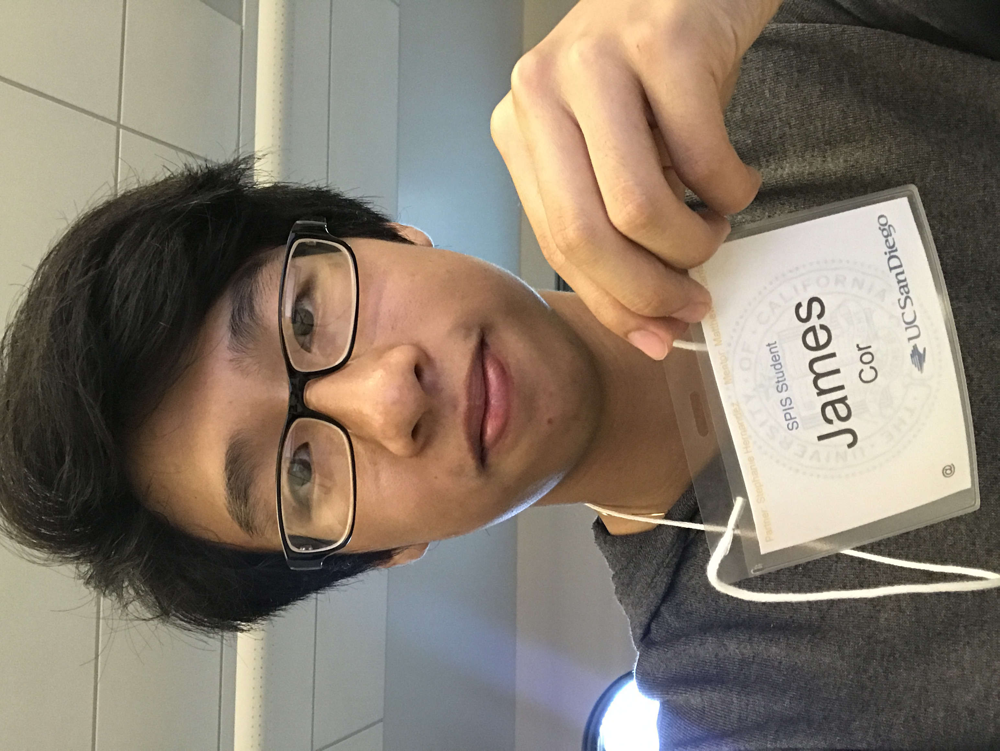

# practice-james-c
Hello! My name is James Cor and I'm from Downtown Los Angeles, near the Chinatown Area.
I hope that SPIS can introduce me to fundamentals of Computer Science and prepare me for the classes in the Fall Quarter. 
I attended a high school with a large focus on the arts. My main instrument was the Cello, which I've played for about 8 years, but I do have some experience with Guitar and Flute. Currently, I'm starting to learn the piano. I don't really play any sports, but I do like to run and go the gym from time to time. 

